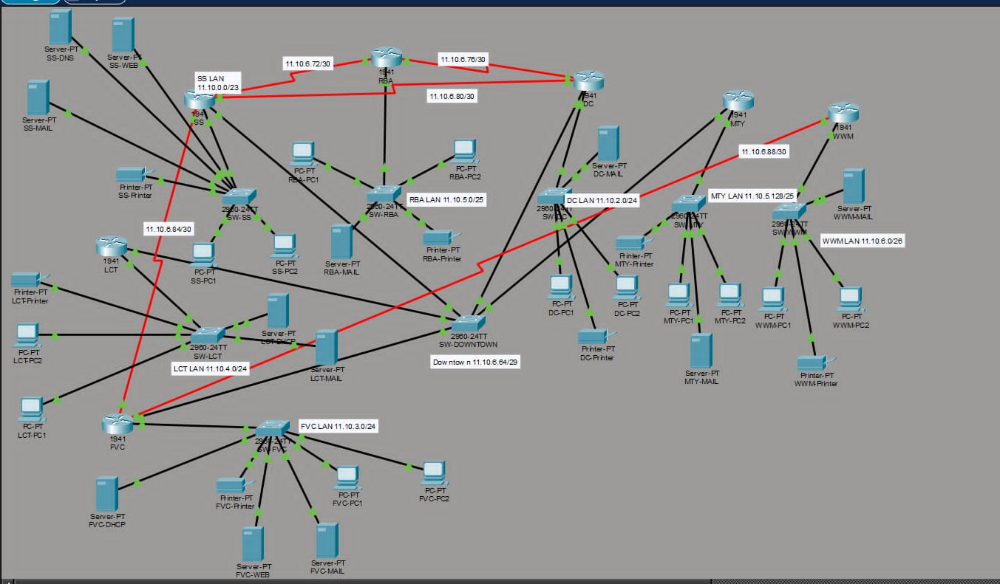

# Ka-Chow Net: The Radiator Springs Network

A **CSE421 Computer Networks** project built in **Cisco Packet Tracer** for seven units of Radiator Springs. It combines VLSM addressing, dynamic and static routing, automatic IP configuration, application services, and backup routes.

**Group:** 1808 · **Section:** 18 · **Base network:** `11.10.0.0/16`

## Start here

1. Download [the Packet Tracer project](packet-tracer/Group1808_Ka-Chow_Net.pkt), or download the repository through **Code → Download ZIP** and extract it.
2. Open `Group1808_Ka-Chow_Net.pkt` in Cisco Packet Tracer. The uploaded materials do not specify the exact version used.
3. Let the links initialize, then inspect devices in **Realtime Mode** or follow packets in **Simulation Mode**.
4. Follow the [verification guide](docs/verification-guide.md) to check addressing, services, routing, and failover.

## Project files

| Location | Contents |
| --- | --- |
| [packet-tracer/Group1808_Ka-Chow_Net.pkt](packet-tracer/Group1808_Ka-Chow_Net.pkt) | Network simulation and saved settings |
| [docs/project-report.md](docs/project-report.md) | Edited, readable project report |
| [docs/project-report.pdf](docs/project-report.pdf) | Original report and testing screenshots |
| [docs/addressing-plan.md](docs/addressing-plan.md) | Subnets, interfaces, server addresses, and gateways |
| [docs/verification-guide.md](docs/verification-guide.md) | Packet Tracer checks and failover steps |
| [docs/images/](docs/images/) | Network topology and VLSM allocation diagram |
| [configs/](configs/) | Seven router references extracted from the report |

## Network units

| Unit | Name | LAN | Required hosts |
| --- | --- | --- | ---: |
| SS | Sheriff Station | `11.10.0.0/23` | 260 |
| DC | Doc-Hudson Clinic | `11.10.2.0/24` | 180 |
| FVC | Flo V8 Café | `11.10.3.0/24` | 150 |
| LCT | Luigi Casa-Della Tires | `11.10.4.0/24` | 220 |
| RBA | Ramone Body Art | `11.10.5.0/25` | 90 |
| MTY | Mater Tow Yard | `11.10.5.128/25` | 90 |
| WWM | Wheel Well Motel | `11.10.6.0/26` | 40 |

The topology has **7 routers**, **8 switches**, **14 PCs**, **7 printers**, and servers for DHCP, DNS, HTTP, and email. SS, LCT, DC, FVC, and MTY share Downtown subnet `11.10.6.64/29`. Five `/30` serial links connect SS–RBA, RBA–DC, DC–SS, SS–FVC, and FVC–WWM.

## Implemented features

- **VLSM:** LAN and transit allocations within `11.10.0.0/16`.
- **RIPv2:** SS, RBA, and DC form the Gossip Loop, with automatic summarization disabled and end-device interfaces passive.
- **Static routing:** Specific, exit-interface, and default routes connect the remaining units. SS redistributes static routes into RIP.
- **Backup routes:** FVC has a recursive next-hop backup through LCT; LCT has a floating static backup through DC. Both use administrative distance 5.
- **DHCP and relay:** SS serves SS, RBA, and DC; LCT's server serves LCT and MTY; FVC's server serves FVC and WWM.
- **DNS and HTTP:** Central DNS at `11.10.0.2`, with web servers at SS and FVC.
- **Email:** A local mail server in each unit, with reported two-way tests between `sheriff.rs` and `flo.rs`.

## Verification status

The original report documents DHCP, web access, cross-domain email, ping, traceroute, and backup-route tests. Repository checks confirm that the documented subnets are aligned, do not overlap, and have enough host capacity. The `.pkt` file has not been executed during this cleanup; follow the verification guide to confirm its current runtime behavior.
