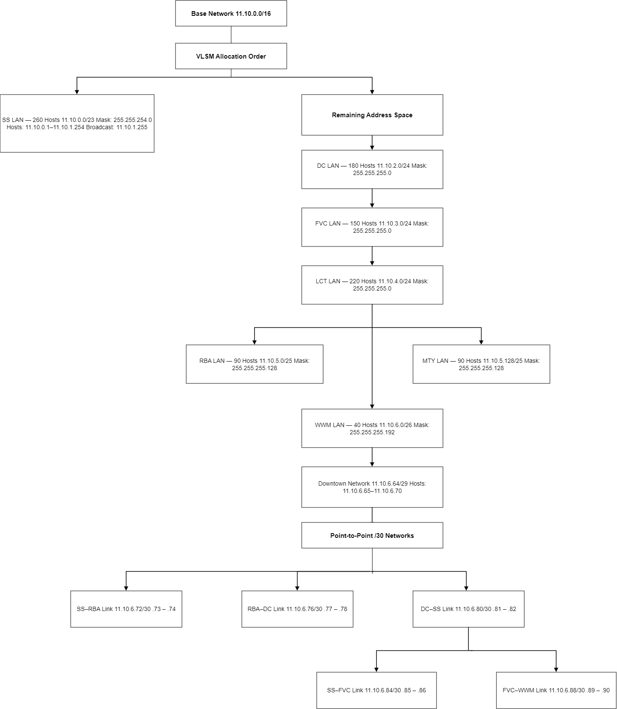

# IP addressing plan

Base network: **11.10.0.0/16**, derived from the first group member's student ID, **22201110**. The last four digits are split into `11` and `10`.

The project allocates LANs in the required order **SS, DC, FVC, LCT, RBA, MTY, WWM**, followed by the transit segments. This is an allocation order, not a strict descending sort by host count. Each subnet still has enough capacity.

## VLSM allocations

| Segment | Required hosts | Network/prefix | Subnet mask | Usable hosts | Broadcast | Capacity |
| --- | ---: | --- | --- | --- | --- | ---: |
| SS | 260 | `11.10.0.0/23` | `255.255.254.0` | `11.10.0.1` - `11.10.1.254` | `11.10.1.255` | 510 |
| DC | 180 | `11.10.2.0/24` | `255.255.255.0` | `11.10.2.1` - `11.10.2.254` | `11.10.2.255` | 254 |
| FVC | 150 | `11.10.3.0/24` | `255.255.255.0` | `11.10.3.1` - `11.10.3.254` | `11.10.3.255` | 254 |
| LCT | 220 | `11.10.4.0/24` | `255.255.255.0` | `11.10.4.1` - `11.10.4.254` | `11.10.4.255` | 254 |
| RBA | 90 | `11.10.5.0/25` | `255.255.255.128` | `11.10.5.1` - `11.10.5.126` | `11.10.5.127` | 126 |
| MTY | 90 | `11.10.5.128/25` | `255.255.255.128` | `11.10.5.129` - `11.10.5.254` | `11.10.5.255` | 126 |
| WWM | 40 | `11.10.6.0/26` | `255.255.255.192` | `11.10.6.1` - `11.10.6.62` | `11.10.6.63` | 62 |
| Downtown | 5 | `11.10.6.64/29` | `255.255.255.248` | `11.10.6.65` - `11.10.6.70` | `11.10.6.71` | 6 |
| SS-RBA | 2 | `11.10.6.72/30` | `255.255.255.252` | `11.10.6.73` - `11.10.6.74` | `11.10.6.75` | 2 |
| RBA-DC | 2 | `11.10.6.76/30` | `255.255.255.252` | `11.10.6.77` - `11.10.6.78` | `11.10.6.79` | 2 |
| DC-SS | 2 | `11.10.6.80/30` | `255.255.255.252` | `11.10.6.81` - `11.10.6.82` | `11.10.6.83` | 2 |
| SS-FVC | 2 | `11.10.6.84/30` | `255.255.255.252` | `11.10.6.85` - `11.10.6.86` | `11.10.6.87` | 2 |
| FVC-WWM | 2 | `11.10.6.88/30` | `255.255.255.252` | `11.10.6.89` - `11.10.6.90` | `11.10.6.91` | 2 |

## Router interfaces

These assignments are transcribed from Appendix A of the [uploaded report](project-report.pdf).

| Router | Interface | IP/prefix | Segment | DHCP relay target |
| --- | --- | --- | --- | --- |
| SS | `GigabitEthernet0/0` | `11.10.0.1/23` | SS | - |
| SS | `GigabitEthernet0/1` | `11.10.6.65/29` | Downtown | - |
| SS | `Serial0/0/0` | `11.10.6.73/30` | SS-RBA | - |
| SS | `Serial0/0/1` | `11.10.6.81/30` | DC-SS | - |
| SS | `Serial0/1/0` | `11.10.6.85/30` | SS-FVC | - |
| LCT | `GigabitEthernet0/0` | `11.10.4.1/24` | LCT | - |
| LCT | `GigabitEthernet0/1` | `11.10.6.66/29` | Downtown | - |
| DC | `GigabitEthernet0/0` | `11.10.2.1/24` | DC | `11.10.6.81` |
| DC | `GigabitEthernet0/1` | `11.10.6.67/29` | Downtown | - |
| DC | `Serial0/1/0` | `11.10.6.78/30` | RBA-DC | - |
| DC | `Serial0/1/1` | `11.10.6.82/30` | DC-SS | - |
| FVC | `GigabitEthernet0/0` | `11.10.3.1/24` | FVC | - |
| FVC | `GigabitEthernet0/1` | `11.10.6.68/29` | Downtown | - |
| FVC | `Serial0/1/0` | `11.10.6.86/30` | SS-FVC | - |
| FVC | `Serial0/1/1` | `11.10.6.89/30` | FVC-WWM | - |
| RBA | `GigabitEthernet0/0` | `11.10.5.1/25` | RBA | `11.10.6.73` |
| RBA | `Serial0/1/0` | `11.10.6.74/30` | SS-RBA | - |
| RBA | `Serial0/1/1` | `11.10.6.77/30` | RBA-DC | - |
| MTY | `GigabitEthernet0/0` | `11.10.5.129/25` | MTY | `11.10.4.2` |
| MTY | `GigabitEthernet0/1` | `11.10.6.69/29` | Downtown | - |
| WWM | `GigabitEthernet0/0` | `11.10.6.1/26` | WWM | `11.10.3.2` |
| WWM | `Serial0/1/0` | `11.10.6.90/30` | FVC-WWM | - |

## Static devices and PC gateways

PCs use DHCP. Servers and printers have static addresses.

| Unit | Default gateway | Static servers | Printer | DHCP provider |
| --- | --- | --- | --- | --- |
| SS | `11.10.0.1` | DNS `11.10.0.2`; web `11.10.0.3`; mail `11.10.0.4` | `11.10.0.5` | SS router |
| DC | `11.10.2.1` | Mail `11.10.2.2` | `11.10.2.3` | SS router via relay |
| FVC | `11.10.3.1` | DHCP `11.10.3.2`; web `11.10.3.3`; mail `11.10.3.4` | `11.10.3.5` | FVC server |
| LCT | `11.10.4.1` | DHCP `11.10.4.2`; mail `11.10.4.3` | `11.10.4.4` | LCT server |
| RBA | `11.10.5.1` | Mail `11.10.5.2` | `11.10.5.3` | SS router via relay |
| MTY | `11.10.5.129` | Mail `11.10.5.130` | `11.10.5.131` | LCT server via relay |
| WWM | `11.10.6.1` | Mail `11.10.6.2` | `11.10.6.3` | FVC server via relay |

All DHCP clients use central DNS server **11.10.0.2**. The SS router excludes addresses `.1` through `.10` in each of its SS, DC, and RBA pools, as shown in [SS.cfg](../configs/SS.cfg). DHCP pool settings for the LCT and FVC Server-PT devices must be reviewed in Packet Tracer; they are not router commands.

## Allocation diagram

The uploaded diagram shows allocation order. Its arrows do not represent network containment or physical links.
